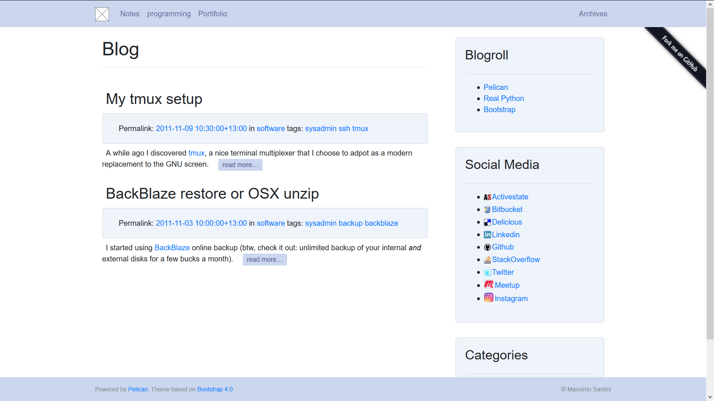

# bootstrap4 #

This was inspired by the [Bootstrap theme](https://github.com/pelican-themes/bootstrap), by [getpelican](https://github.com/getpelican).

This theme relies on Bootstrap 4 and Jquery libraries.

## changelog ##

11/29/2017:

- *Check and Test against mock site, preparation for beta.*
- *Test behaviour if new optional settings are missing.*

11/03/2017:

- *Updated to Bootstrap v4.0.0.beta.2.*
- *Moved sidebar to right.*
- *Broke sidebar into sections: blogroll, social media links, and optional authors, categories, and tags.*
- *Archives moved to top navigation menu, far right*
- *no categories, authors or tags pages used, no such pages listed in top navigation menu*
- *Replaced home link in top navigation menu with image link to home page.*
- *added arias for accessibility and screen readers.*
- *added social icons for links referring meetup.com, anaconda.org and instagram.com. Updated reference for del.icio.us*

## features ##

### general ###

- Where possible, the default behaviour of the bootstrap 4 theme has been followed.
- Additionally the theme should be reasonably accessible for the visually impaired and for screen readers.

### caveats ###

There may be difficulty viewing the site on small or narrow screens.

### new optional settings ###

Your pelican settings file may use the following additional settings:

`SITE_DESCRIPTION = 'description of the website'`, for the description meta tag.

`SHOW_AUTHORS = False`, Determines if the author, and an appropriate link, for each indexed article, is shown in the metadata. This only applies if the article in question has an author.

`SHOW_AUTHORS_SIDEBAR = False`, Show a sidebar card listing links for authors of articles. Note that if all articles only ever have one author, an Author sidebar will never be shown anyway.

`SHOW_CATEGORIES_SIDEBAR = False`, Show a sidebar card listing links for categories.

`SHOW_TAGS_SIDEBAR = False`, Show a sidebar card listing links for tags.

## Screenshot ##

